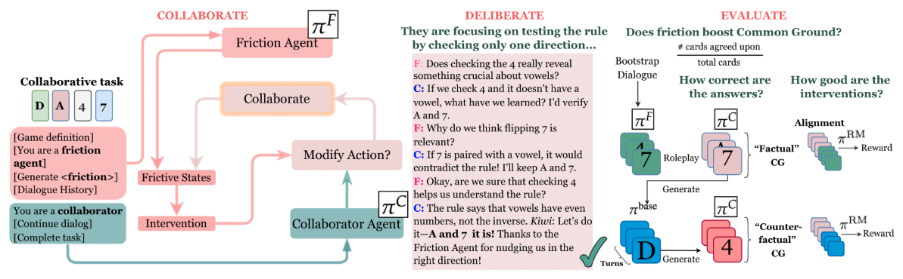

# Roleplay-for-Collaborative-Dialogues
Git repo for source code to run experiments for our paper, "Let's Roleplay: Examining LLM Alignment in Collaborative Dialogues" — published at the ORIGen Workshop at COLM 2025. Figure below shows a high-level overview of our experimental design. 
 

  

## Main Files

- **`config.py`**  
  Configuration and hyperparameter settings for FRICTION AGENT++ training.  
  - Defines FRICTION AGENT++ and ablation losses.

- **`friction_plus_plus_training.py`**  
  Main training script for FRICTION++ AGENT using the [Frictional Agent Alignment Framework](https://aclanthology.org/2025.acl-long.542/).
  - Run DPO (`loss_type="sigmoid"`) and IPO (`loss_type="ipo"`) baselines using loss_type as shown. 
  - Manages hyperparameter sweeps and logging metrics. 

- **`friction_trainer.py`**  
  Core implementation of FRICTION++ loss with TRL integration.  
  - Computes loss and handles phi-unconditioned forward passes.  
  - Implements preference alignment.

- **`friction_roleplay_collaboration.py`**  
  Roleplaying loop for data generation.  
  - Records data for counterfactual evaluation.  
  - Produces turn-based dialogue between friction and collaborator agents.

- **`RM.py`**  
  Reward modeling implementation.  
  - Utilizes OPT models for reward computation.  
  - Supports PPO training.

- **`bc_expert.py`**  
  BC-EXPERT baseline implementation.  
  - Trains a base instruct model with SFT on all friction tokens (not just trajectory-end completions).  
  - Excludes loss computation on non-completion state parts.

- **`counterfactual_eval.py`**  
  Counterfactual evaluation of baselines on SFT trajectories.  
  - Uses data sampled from `friction_roleplay_collaboration.py`.  
  - Computes rewards, margins, and win rates against the SFT model.  
  - Generates evaluation metrics.
 
- **`common_ground_extraction.py`**  
  Code to extract the common-ground relations from utterances of the collaborator agent using the LLM Judge. We use GPT-4o as Judge. 

- **`common_ground_evaluation.py`**  
  Computes common ground metrics for Weights Task data (WTD) and Delidata (DELI) datasets. For WTD common ground computation, run common_ground_extraction.py to first extract the common ground with the LLM Judge (We use GPT-4o). 

- **`roleplay_utils.py`**  
  Helper functions for parsing blocks, cards, and computing basic metrics.
